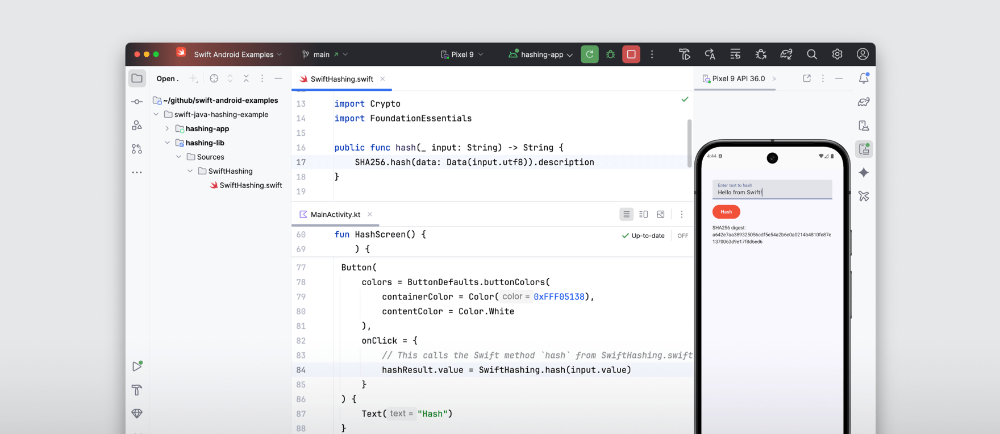

Чтобы писать их на одном языке сразу для двух платформ.

  * С помощью Swift SDK for Android разработчики смогут писать приложения для Android на языке Swift — он предназначен для разработки приложений для iOS и macOS, [сообщила](https://api.vc.ru/v2.8/redirect?to=https%3A%2F%2Fwww.swift.org%2Fblog%2Fnightly-swift-sdk-for-android%2F&postId=2298070) компания.
  * При этом нативно Android не поддерживает Swift — инструмент перекомпилирует код в Kotlin или Java.

  * В результате iOS-разработчики смогут писать приложения на одном языке — но сразу и на iOS, и на Android.
  * Swift SDK для Android доступен в комплекте с установщиком для Windows или для загрузки в Linux или macOS.

[#новости](/tag/новости) [#ios](/tag/ios) [#swift](/tag/swift) [#kotlin](/tag/kotlin) [#java](/tag/java)