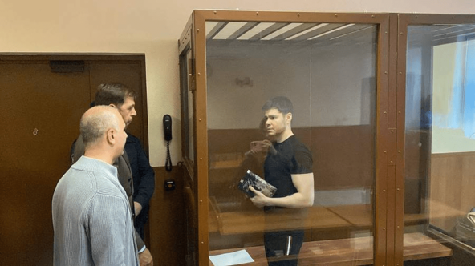
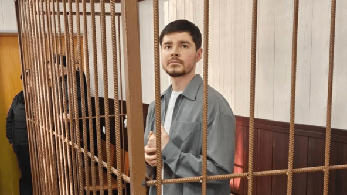

# Обвинение запросило для Аяза Шабутдинова восемь лет колонии по делу омошенничестве

Приговор пока не вынесли.

Источник: «Известия»

  * Прокурор запросила восемь лет лишения свободы и штраф в 15 млн рублей для блогера и бизнес-тренера Аяза Шабутдинова, [пишет](https://api.vc.ru/v2.8/redirect?to=https%3A%2F%2Ftass.ru%2Fproisshestviya%2F25434679&postId=2294129) ТАСС. А кроме того — запретить ему на пять лет заниматься деятельностью, связанной с образованием.
  * Шабутдинова обвиняют в 113 эпизодах преступлений, предусмотренных [ч.4 ст.159 УК](https://api.vc.ru/v2.8/redirect?to=https%3A%2F%2Fwww.consultant.ru%2Fdocument%2Fcons_doc_LAW_10699%2F8012ecdf64b7c9cfd62e90d7f55f9b5b7b72b755%2F&postId=2294129), — это мошенничество в особо крупном размере, совершённое группой лиц. По [словам](https://api.vc.ru/v2.8/redirect?to=https%3A%2F%2Ft.me%2Ftass_agency%2F345337&postId=2294129) адвоката, Шабутдинов возместил ущерб 73 потерпевшим по делу.
  * Блогера [задержали](https://vc.ru/money/902235) в ноябре 2023 года по подозрению в мошенничестве. Некоторые покупатели его курсов [сообщили](https://vc.ru/money/902598-ayaza-shabutdinova-zaderzhali-posle-zayavleniy-vosmi-uchenikov-otdavshih-za-ego-kursy-4-mln-rubley), что те сводились к призыву «верьте в себя, и всё получится».
  * В декабре московская прокуратура [арестовала](https://vc.ru/legal/944158-moskovskaya-prokuratura-arestovala-28-schetov-po-ugolovnomu-delu-ayaza-shabutdinova) 28 счетов по делу — самого Шабутдинова и его возможного соучастника, [Василия Алексеева](https://api.vc.ru/v2.8/redirect?to=https%3A%2F%2Fwww.vesti.ru%2Farticle%2F3887796&postId=2294129) (объявлен в розыск и заочно арестован). В апреле 2024 года суд [наложил](https://vc.ru/legal/1109389-sud-arestoval-imushchestvo-ayaza-shabutdinova) арест ещё на часть активов бизнесмена.

  * В начале апреля 2025 года Шабутдинов [признал ](https://vc.ru/legal/1902725-ayaz-shabutdinov-priznal-vinu-v-moshennichestve)вину в мошенничестве, написав об этом в Telegram-канале. Он сообщил, что раскаивается и готов «упорно работать над восстановлением доверия», а также попросил прощения. Адвокат подтвердил признание вины его подзащитным.

[Евгения Евсеева](/id617692)

[Право](/id199120)

[5 мая](/id199120/1966719-ayaz-shabutdinov-polnostyu-priznal-v-sude-vinu-po-delu-o-moshennichestve)

Аяз Шабутдинов полностью признал в суде вину по делу о мошенничестве

До этого он признавал вину в своём Telegram-канале.

[#новости](/tag/новости) [#аязшабудтинов](/tag/аязшабудтинов)