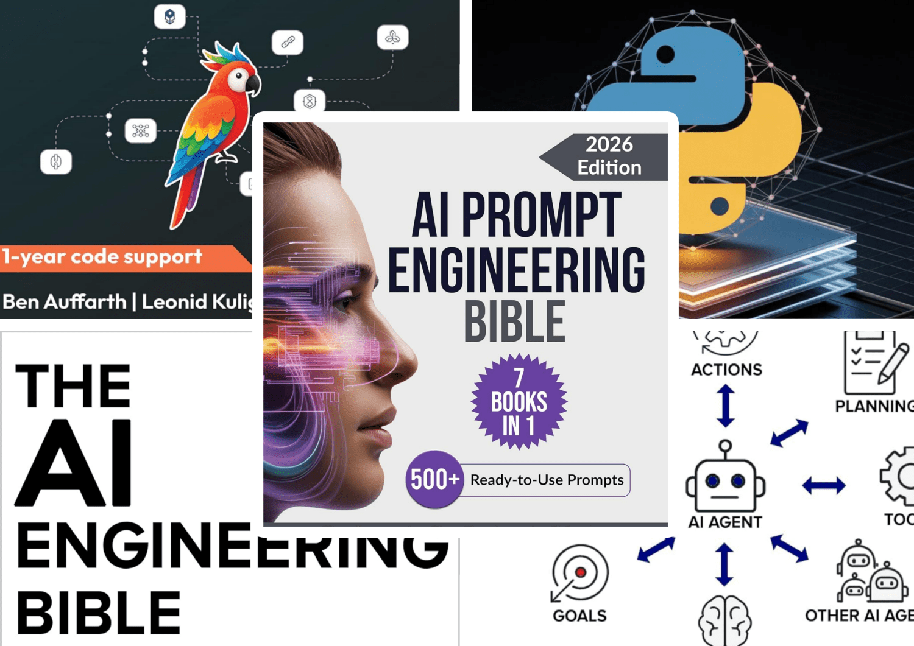

Представляем вашему вниманию подборку лучших книг по искусственному интеллекту за 2025 год, получивших высокую оценку от читателей Amazon. Книги доступны как на русском, так и на английском языках.

**[Лучшие книги по ИИ в 2025 году](https://api.vc.ru/v2.8/redirect?to=https%3A%2F%2Fbooken.ru%2Fluchshie-knigi-po-ii-2025-booken-ru%2F%3Fcoupon%3Dvcru-best_ai_2025&postId=2288156)**

  1. Библия инженеров ИИ (The AI Engineering Bible)
  2. Библия разработчиков ИИ-агентов (The Agentic AI Bible)

  3. Библия для промпт-инженеров (AI Prompt Engineering Bible)

  4. Генеративный ИИ с LangChain (Generative AI with LangChai)

  5. Основы CrewAI (Mastering CrewAI)

## 1\. Библия инженеров ИИ (The AI Engineering Bible: The Complete and Up-to-Date Guide to Build, Develop and Scale Production Ready AI Systems)

4.8 🌕🌕🌕🌕🌖 684

🥇Бестселлер: компьютерная инженерия

**[Библия инженеров ИИ (The AI Engineering Bible)](https://api.vc.ru/v2.8/redirect?to=https%3A%2F%2Fbooken.ru%2Fluchshie-knigi-po-ii-2025-booken-ru%2F%3Fcoupon%3Dvcru-best_ai_2025&postId=2288156)**. Thomas R. Caldwell. 2025

Комплексное практическое руководство по созданию, развертыванию и масштабированию реальных систем ИИ

Хотя ИИ доминирует в заголовках новостей, большинство организаций сталкиваются с другой реальностью: замороженные проекты, хрупкая инфраструктура, дорогостоящее развертывание и отсутствие четкой структуры для создания масштабируемых и надежных систем.

«Библия инженеров ИИ» напрямую устраняет этот пробел.

Эта книга, написанная для инженеров, технических руководителей, архитекторов ИИ и владельцев продуктов. Книга предлагает четкий и систематический подход к созданию готовых к производству систем с ИИ, основанных на современных передовых практиках, масштабируемой инфраструктуре и реальном применении.

Охватывая все этапы жизненного цикла ИИ — от определения проблемы и сбора данных до развертывания, оптимизации и долгосрочного обслуживания — она предоставляет структуру и техническую глубину, необходимые специалистам для уверенного руководства масштабными инициативами в области ИИ.

### С этим универсальным руководством вы сможете:

  * **Четко сформулировать задачу и спланировать ИИ-систему** : от целей и архитектуры до этики и взаимодействия с пользователем
  * **Надежно построить все уровни** : пайплайны данных, препроцессинг, обучение, оркестрацию и выбор моделей
  * **Уверенно внедрить ИИ в продакшн** : контейнеризация, облачная инфраструктура, безопасные API и контроль версий
  * **Масштабировать систему без узких мест** : распределённый инференс, федеративное обучение, балансировка нагрузки
  * **Оптимизировать производительность** : задержки, память, стоимость — с помощью компрессии, квантования и профилирования
  * **Обеспечить устойчивость** : мониторинг, переобучение, обратная связь, управление и постоянное улучшение

> Купить книгу **«Библия инженеров ИИ» (The AI Engineering Bible)** можно на сайте [Booken.ru](https://api.vc.ru/v2.8/redirect?to=https%3A%2F%2Fbooken.ru%2Fluchshie-knigi-po-ii-2025-booken-ru%2F%3Futm_source%3Dvcru%26utm_medium%3Dbest_ai_2025%26coupon%3Dvcru-best_ai_2025&postId=2288156)
>
> • [на русском языке](https://api.vc.ru/v2.8/redirect?to=https%3A%2F%2Fbooken.ru%2Forder%2F%3Futm_source%3Dvcru%26utm_medium%3Dbest_ai_2025%26coupon%3Dvcru-best_ai_2025%26book_name%3D%25D0%2591%25D0%25B8%25D0%25B1%25D0%25BB%25D0%25B8%25D1%258F%2520%25D0%25B8%25D0%25BD%25D0%25B6%25D0%25B5%25D0%25BD%25D0%25B5%25D1%2580%25D0%25BE%25D0%25B2%2520%25D0%2598%25D0%2598%2520by%2520The%2520AI%2520Engineering%2520Bible&postId=2288156) (PDF, EPUB)
>
> • [на английском](https://api.vc.ru/v2.8/redirect?to=https%3A%2F%2Fbooken.ru%2Famazon_buy%2F%3Futm_source%3Dvcru%26utm_medium%3Dbest_ai_2025%26coupon%3Dvcru-best_ai_2025%26book_link%3Dhttps%3A%2F%2Fwww.amazon.com%2Fdp%2FB0F4KZJN6Z&postId=2288156) (PDF, EPUB)

## 2\. Библия разработчиков ИИ-агентов (The Agentic AI Bible: The Complete and Up-to-Date Guide to Design, Build, and Scale Goal-Driven, LLM-Powered Agents that Think, Execute and Evolve)

4.7 🌕🌕🌕🌕🌖 354

🥇Бестселлер: нейронные сети

**[Библия разработчиков ИИ-агентов (The Agentic AI Bible)](https://api.vc.ru/v2.8/redirect?to=https%3A%2F%2Fbooken.ru%2Fluchshie-knigi-po-ii-2025-booken-ru%2F%3Fcoupon%3Dvcru-best_ai_2025&postId=2288156)**. Thomas R. Caldwell. 2025

Агентный ИИ — это больше не футуристическая мечта, а следующая фаза развития интеллектуального программного обеспечения. Однако путь к созданию рабочих систем полон хаоса: неуклюжие прототипы, хрупкие инструменты и отсутствие четкой архитектуры.

«Библия разработчиков ИИ-агентов» дает ясные и практические ответы на эти вызовы. Это руководство для инженеров, архитекторов систем и AI-лидеров, которое охватывает весь жизненный цикл агентных систем — от принципов проектирования до развертывания.

### Ключевые темы книги:

  * **Модульная архитектура** : принципы и паттерны для создания агентов с рассуждением, памятью и планированием.
  * **Восприятие и действие** : реализация агентов, которые взаимодействуют с миром, а не просто отвечают на запросы.
  * **Безопасность и надежность** : 3 стратегии проектирования для предотвращения катастрофических ошибок и сохранения контроля над агентами.
  * **Интеграция с внешним миром** : подключение агентов к инструментам, API и долгосрочным рабочим процессам для выполнения многошаговых задач.
  * **Масштабирование и мониторинг** : архитектуры развертывания и системы мониторинга, обеспечивающие непрерывное улучшение ваших агентов.

> Купить книгу **«Библия разработчиков ИИ-агентов» (The Agentic AI Bible)** можно на сайте [Booken.ru](https://api.vc.ru/v2.8/redirect?to=https%3A%2F%2Fbooken.ru%2Fluchshie-knigi-po-ii-2025-booken-ru%2F%3Futm_source%3Dvcru%26utm_medium%3Dbest_ai_2025%26coupon%3Dvcru-best_ai_2025&postId=2288156)
>
> • [на русском языке](https://api.vc.ru/v2.8/redirect?to=https%3A%2F%2Fbooken.ru%2Forder%2F%3Futm_source%3Dvcru%26utm_medium%3Dbest_ai_2025%26coupon%3Dvcru-best_ai_2025%26book_name%3D%25D0%2591%25D0%25B8%25D0%25B1%25D0%25BB%25D0%25B8%25D1%258F%2520%25D1%2580%25D0%25B0%25D0%25B7%25D1%2580%25D0%25B0%25D0%25B1%25D0%25BE%25D1%2582%25D1%2587%25D0%25B8%25D0%25BA%25D0%25BE%25D0%25B2%2520%25D0%2598%25D0%2598-%25D0%25B0%25D0%25B3%25D0%25B5%25D0%25BD%25D1%2582%25D0%25BE%25D0%25B2%2520by%2520The%2520Agentic%2520AI%2520Bible&postId=2288156) (PDF, EPUB)
>
> • [на английском](https://api.vc.ru/v2.8/redirect?to=https%3A%2F%2Fbooken.ru%2Famazon_buy%2F%3Futm_source%3Dvcru%26utm_medium%3Dbest_ai_2025%26coupon%3Dvcru-best_ai_2025%26book_link%3Dhttps%3A%2F%2Fwww.amazon.com%2Fdp%2FB0FJ9QGK8S&postId=2288156) (PDF, EPUB)

## 3\. Библия для промпт-инженеров (AI Prompt Engineering Bible (7 Books in 1): Beginner-to-Pro System to Master ChatGPT and Generative AI for Powerful Results and Real Income (The Generative AI Creator Series))

4.8 🌕🌕🌕🌕🌖 177

🥇Бестселлер: в области компьютерной обработки изображений

**[Библия для промпт-инженеров (AI Prompt Engineering Bible)](https://api.vc.ru/v2.8/redirect?to=https%3A%2F%2Fbooken.ru%2Fluchshie-knigi-po-ii-2025-booken-ru%2F%3Fcoupon%3Dvcru-best_ai_2025&postId=2288156)**. Tomasz Dylik. 2025

Если вы хотите освоить ChatGPT, Midjourney и другие генеративные ИИ-инструменты, но чувствуете себя потерянным или не знаете, что ввести — эта книга для вас.

Это всеобъемлющее руководство «7 в 1» развенчивает миф о том, что промпт-инжиниринг — это секретный навык для технической элиты. Это обучаемая система, и данная книга предоставляет вам готовый фреймворк для достижения точных результатов каждый раз.

### Чему вы научитесь:

  * **Структурирование промптов** : превращайте расплывчатые запросы в четкие команды, которые дают именно то, что вы хотите.
  * **Создание контента** : написание блог-постов, маркетинговых текстов, сценариев и профессиональных писем.
  * **Генерация изображений и аудио** : создавайте уникальный дизайн, фотореалистичные изображения, музыку и звуковые ландшафты без специального опыта.
  * **Монетизация навыков** : реальные примеры и бизнес-модели для получения дохода с помощью промпт-инжиниринга.
  * **Бесплатные бонусы** : доступ к набору с 500+ готовыми промптами для текста, визуалов, аудио и видео.

> Купить книгу **«Библия для промпт-инженеров» (AI Prompt Engineering Bible)** можно на сайте [Booken.ru](https://api.vc.ru/v2.8/redirect?to=https%3A%2F%2Fbooken.ru%2Fluchshie-knigi-po-ii-2025-booken-ru%2F%3Futm_source%3Dvcru%26utm_medium%3Dbest_ai_2025%26coupon%3Dvcru-best_ai_2025&postId=2288156)
>
> • [на русском языке](https://api.vc.ru/v2.8/redirect?to=https%3A%2F%2Fbooken.ru%2Forder%2F%3Futm_source%3Dvcru%26utm_medium%3Dbest_ai_2025%26coupon%3Dvcru-best_ai_2025%26book_name%3D%25D0%2591%25D0%25B8%25D0%25B1%25D0%25BB%25D0%25B8%25D1%258F%2520%25D0%25B4%25D0%25BB%25D1%258F%2520%25D0%25BF%25D1%2580%25D0%25BE%25D0%25BC%25D0%25BF%25D1%2582-%25D0%25B8%25D0%25BD%25D0%25B6%25D0%25B5%25D0%25BD%25D0%25B5%25D1%2580%25D0%25BE%25D0%25B2%2520by%2520AI%2520Prompt%2520Engineering%2520Bible&postId=2288156) (PDF, EPUB)
>
> • [на английском](https://api.vc.ru/v2.8/redirect?to=https%3A%2F%2Fbooken.ru%2Famazon_buy%2F%3Futm_source%3Dvcru%26utm_medium%3Dbest_ai_2025%26coupon%3Dvcru-best_ai_2025%26book_link%3Dhttps%3A%2F%2Fwww.amazon.com%2Fdp%2FB0FHDQ62YJ&postId=2288156) (PDF, EPUB)

## 4\. Генеративный ИИ с LangChain (Generative AI with LangChain: Build production-ready LLM applications and advanced agents using Python, LangChain, and LangGraph)

4.5 🌕🌕🌕🌕🌗 34

🥇Бестселлер: в области обработки естественного языка

**[Генеративный ИИ с LangChain (Generative AI with LangChain)](https://api.vc.ru/v2.8/redirect?to=https%3A%2F%2Fbooken.ru%2Fluchshie-knigi-po-ii-2025-booken-ru%2F%3Fcoupon%3Dvcru-best_ai_2025&postId=2288156)**. Ben Auffarth, Leonid Kuligin. 2025

Это второе издание — мастер-класс по превращению приложений на больших языковых моделях (LLM) из идеи в готовое enterprise-решение. Полностью обновленное согласно последним разработкам в экосистеме LangChain, оно фокусируется на самой большой проблеме: переходе от прототипов к продакшену.

Книга делает сильный акцент на многоагентных архитектурах, надежных рабочих процессах на LangGraph и продвинутых RAG-конвейерах (Retrieval-Augmented Generation).

Для кого эта книга: для разработчиков Python и инженерных команд, внедряющих LLM-решения в промышленных масштабах. Требуется базовое понимание Python.

### Что вы освоите:

  * **Многоагентные системы** : проектирование и реализация с использованием LangGraph и MCP (Model Context Protocol).
  * **Производственные RAG-системы** : построение интеллектуальных систем с гибридным поиском, реранкингом и проверкой фактов.
  * **Тестирование и observability** : стратегии, которые выявляют проблемы до развертывания, и решения для мониторинга production-сред.
  * **Безопасность и соответствие** : проектирование безопасных и этичных ИИ-систем в соответствии с современными практиками.
  * **Работа с современными моделями** : использование LLM от Google Gemini, Anthropic, Mistral, DeepSeek и OpenAI.

> Купить книгу **«Генеративный ИИ с LangChain» (Generative AI with LangChain)** можно на сайте [Booken.ru](https://api.vc.ru/v2.8/redirect?to=https%3A%2F%2Fbooken.ru%2Fluchshie-knigi-po-ii-2025-booken-ru%2F%3Futm_source%3Dvcru%26utm_medium%3Dbest_ai_2025%26coupon%3Dvcru-best_ai_2025&postId=2288156)
>
> • [на русском языке](https://api.vc.ru/v2.8/redirect?to=https%3A%2F%2Fbooken.ru%2Forder%2F%3Futm_source%3Dvcru%26utm_medium%3Dbest_ai_2025%26coupon%3Dvcru-best_ai_2025%26book_name%3D%25D0%2593%25D0%25B5%25D0%25BD%25D0%25B5%25D1%2580%25D0%25B0%25D1%2582%25D0%25B8%25D0%25B2%25D0%25BD%25D1%258B%25D0%25B9%2520%25D0%2598%25D0%2598%2520%25D1%2581%2520LangChain%2520by%2520Generative%2520AI%2520with%2520LangChain&postId=2288156) (PDF, EPUB)
>
> • [на английском](https://api.vc.ru/v2.8/redirect?to=https%3A%2F%2Fbooken.ru%2Famazon_buy%2F%3Futm_source%3Dvcru%26utm_medium%3Dbest_ai_2025%26coupon%3Dvcru-best_ai_2025%26book_link%3Dhttps%3A%2F%2Fwww.amazon.com%2Fdp%2FB0DYK6PKWM&postId=2288156) (PDF, EPUB)

## 5\. Основы CrewAI (Mastering CrewAI: A Developer's Guide to Building and Orchestrating Autonomous AI Agents in Python)

**[Основы CrewAI (Mastering CrewAI)](https://api.vc.ru/v2.8/redirect?to=https%3A%2F%2Fbooken.ru%2Fluchshie-knigi-po-ii-2025-booken-ru%2F%3Fcoupon%3Dvcru-best_ai_2025&postId=2288156)**. R.C. Weston. 2025

Раскройте весь потенциал автономных ИИ-агентов с этим практическим руководством по **CrewAI**. В отличие от общих ресурсов по ИИ, эта книга — прямое руководство для Python-разработчиков, которые хотят выйти за рамки теории и научиться оркестровать многоагентные системы.

Книга предлагает четкие объяснения, примеры кода и реальные приложения для быстрого внедрения CrewAI в такие области, как автоматизация, анализ данных и клиентская поддержка.

Для кого эта книга: ля Python-разработчиков, инженеров-программистов и всех, кто хочет освоить CrewAI и строить интеллектуальные автономные решения.

### Чему вы научитесь:

  * **Основы CrewAI** : понимание архитектуры и принципов collaboration (сотрудничества) агентов.

  * **Создание автономных агентов** : пошаговое руководство по созданию ИИ-агентов, способных к независимым рассуждениям и исполнению.
  * **Оркестрация агентов** : координация нескольких агентов для выполнения сложных рабочих процессов в реальном мире.
  * **Практические примеры на Python** : написание эффективного, масштабируемого и готового к продакшену кода.
  * **Лучшие практики** : отладка, масштабирование и тонкая настройка агентов для максимальной производительности.

> Купить книгу **«Основы CrewAI» (Mastering CrewAI)** можно на сайте [Booken.ru](https://api.vc.ru/v2.8/redirect?to=https%3A%2F%2Fbooken.ru%2Fluchshie-knigi-po-ii-2025-booken-ru%2F%3Futm_source%3Dvcru%26utm_medium%3Dbest_ai_2025%26coupon%3Dvcru-best_ai_2025&postId=2288156)
>
> • [на русском языке](https://api.vc.ru/v2.8/redirect?to=https%3A%2F%2Fbooken.ru%2Forder%2F%3Futm_source%3Dvcru%26utm_medium%3Dbest_ai_2025%26coupon%3Dvcru-best_ai_2025%26book_name%3D%25D0%259E%25D1%2581%25D0%25BD%25D0%25BE%25D0%25B2%25D1%258B%2520CrewAI%2520by%2520Mastering%2520CrewAI&postId=2288156) (PDF, EPUB)
>
> • [на английском](https://api.vc.ru/v2.8/redirect?to=https%3A%2F%2Fbooken.ru%2Famazon_buy%2F%3Futm_source%3Dvcru%26utm_medium%3Dbest_ai_2025%26coupon%3Dvcru-best_ai_2025%26book_link%3Dhttps%3A%2F%2Fwww.amazon.com%2Fdp%2FB0FR3GNGN9&postId=2288156) (PDF, EPUB)

[#Томас_Колдуэлл](/tag/томас_колдуэлл) [#Thomas_Caldwell](/tag/thomas_caldwell) [#Томаш_Дылик](/tag/томаш_дылик) [#Tomasz_Dylik](/tag/tomasz_dylik) [#Бен_Ауффарт](/tag/бен_ауффарт) [#Ben_Auffarth](/tag/ben_auffarth) [#Леонид_Кулигин](/tag/леонид_кулигин) [#Leonid_Kuligin](/tag/leonid_kuligin) [#Р_С_Уэстон](/tag/р_с_уэстон) [#R_C_Weston](/tag/r_c_weston) [#ИИ](/tag/ии) [#AI](/tag/ai) [#AI_Engineering](/tag/ai_engineering) [#AI_Systems](/tag/ai_systems) [#Искусственный_Интеллект](/tag/искусственный_интеллект) [#ArtificialIntelligence](/tag/artificialintelligence) [#Книги_по_ИИ](/tag/книги_по_ии) [#AI_Books](/tag/ai_books) [#Машинное_Обучение](/tag/машинное_обучение) [#MachineLearning](/tag/machinelearning) [#Промпт_Инжиниринг](/tag/промпт_инжиниринг) [#PromptEngineering](/tag/promptengineering) [#AI_Agents](/tag/ai_agents) [#ИИ_Агенты](/tag/ии_агенты) [#LangChain](/tag/langchain) [#CrewAI](/tag/crewai) [#LangGraph](/tag/langgraph) [#Генеративный_ИИ](/tag/генеративный_ии) [#GenerativeAI](/tag/generativeai) [#DataScience](/tag/datascience) [#Наука_оДанных](/tag/наука_оданных) [#MLOps](/tag/mlops) [#AI_Prod](/tag/ai_prod) [#Продакшен_ИИ](/tag/продакшен_ии) [#Программирование](/tag/программирование) [#Programming](/tag/programming) [#Технологии](/tag/технологии) [#Теch](/tag/теch) [#BookReview](/tag/bookreview) [#купить_книгу](/tag/купить_книгу) [#обзор_книги](/tag/обзор_книги) [#новые_книги](/tag/новые_книги) [#что_почитать](/tag/что_почитать) [#переводчик_книг](/tag/переводчик_книг) [#покупка_книг_на_амазон](/tag/покупка_книг_на_амазон) [#newbooks](/tag/newbooks) [#booken](/tag/booken)